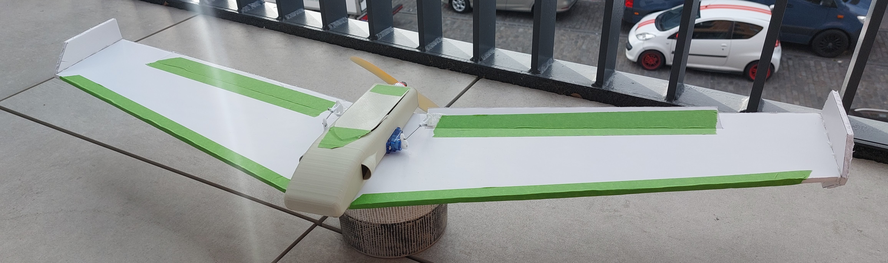
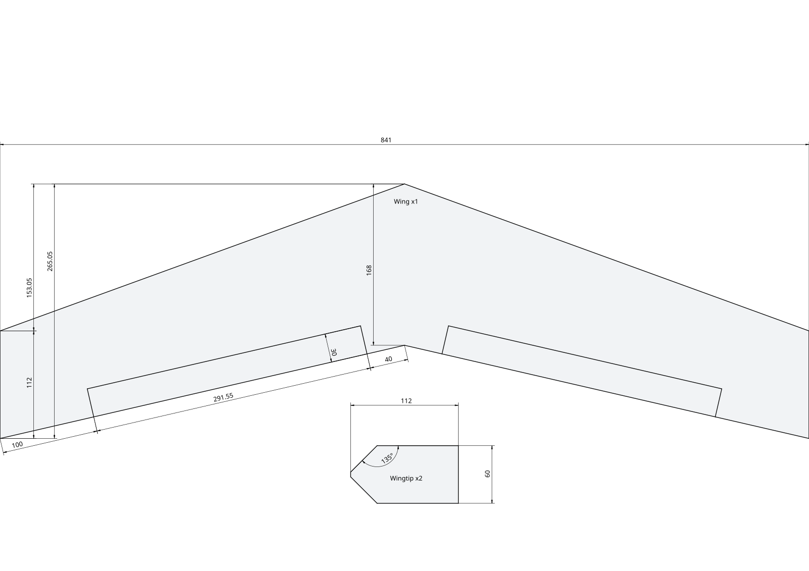
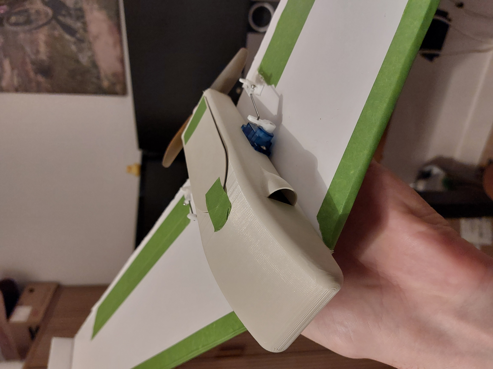
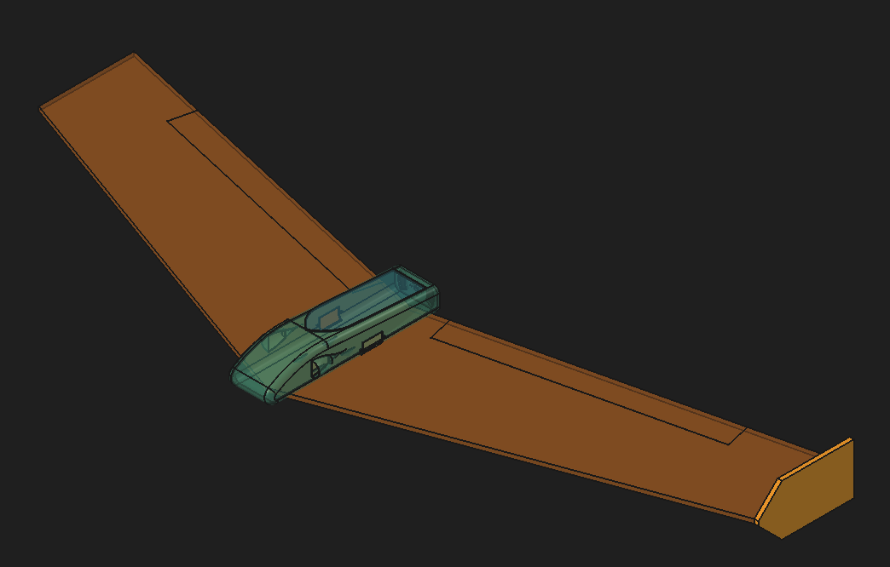

# Sparrowhawk

A sub-250g RC flying wing that is as quick to build as possible: two 3D printed parts for the fuselage, and one simple shape cut from foamboard for the wing.

Sparrowhawk is designed to maximise wingspan, build speed, and robustness while staying under 250g.

- **Wingspan:** 841mm (the full width of an A1 sheet)
- **All-up weight:** 242g as built, including a 3S 850mAh battery
- **Flight time:** 15-20 minutes on a 3S 850mAh battery
- **Aerobatics:** flips and rolls with ease
- **Build:** two printed parts and one sheet of A1 foamboard, which is enough for two wings

## Parts

### Printed

| Part | File |
| --- | --- |
| Fuselage | [`stl/sparrowhawk-Fuselage.stl`](stl/sparrowhawk-Fuselage.stl) |
| Lid | [`stl/sparrowhawk-Lid.stl`](stl/sparrowhawk-Lid.stl) |

I printed my fuselage in PLA to maximise its robustness.

### Foamboard

One sheet of A1 foamboard (841 x 594mm). Each plane needs one wing and two wingtips, and you can cut two wings from a single sheet.

### Electronics

This is what mine is built with:

| Part | Used |
| --- | --- |
| Motor | T-Motor V1507-6S 2700KV |
| Prop | 5030 5 inch 2 blade |
| ESC | 30A with BEC |
| Battery | 3S 850mAh |
| Servos | 2x 9g plastic servo |
| Receiver | Cheap ELRS PWM receiver |
| Transmitter | RadioMaster Pocket |
| Linkages | RC pushrod set (available cheaply on Amazon) |

Mine weighs 242g all-up. You can probably cut more weight by using lighter connectors inside the fuselage.

## Plans

The wing and wingtips are cut from foamboard. All dimensions are in mm, and the sheet is A1.

The full-size A1 plans are in [`plans/sparrowhawk_Plans.svg`](plans/sparrowhawk_Plans.svg).

## Build

1. Print the fuselage and lid.
2. Cut one wing and two wingtips from foamboard using the plans.
3. Cut the elevons free and hinge them back on with tape (also leave a layer of paper and bevel them).
4. Attach the wingtips to the ends of the wing with glue gun.
5. Fit the motor, ESC, receiver, and servos into the fuselage, then attach the fuselage to the wing.
6. Connect the servos to the elevons with the pushrods and control horns.
7. Set up elevon mixing on your transmitter.

## CAD

The full model is in [`sparrowhawk.FCStd`](sparrowhawk.FCStd), which opens in [FreeCAD](https://www.freecad.org/).

